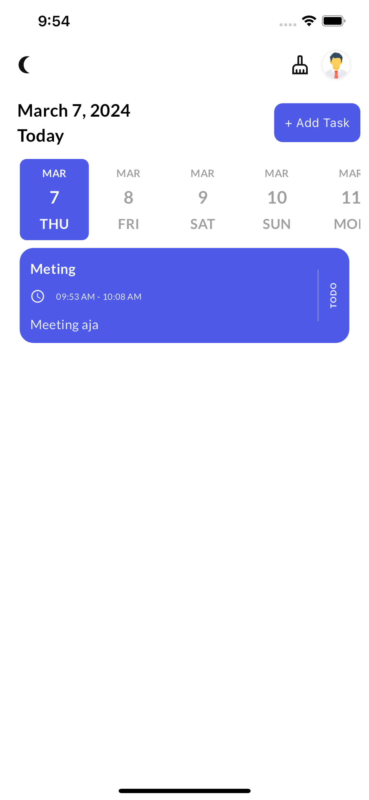
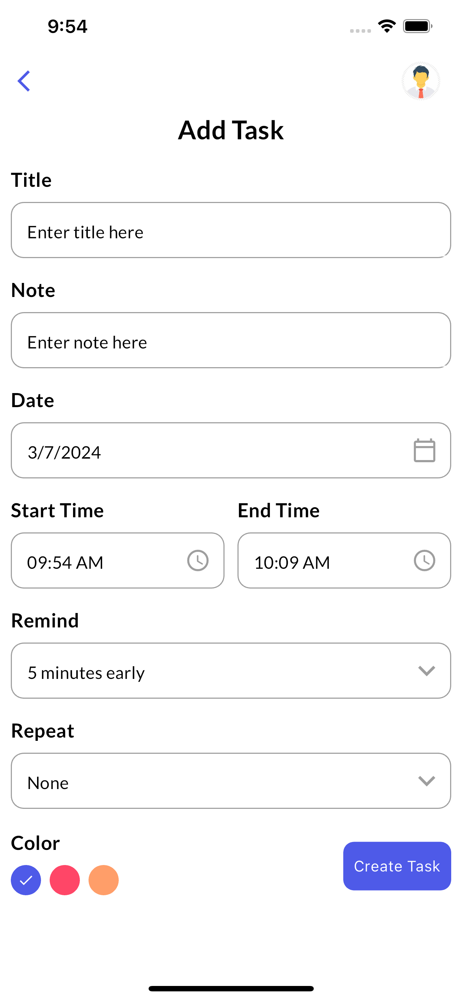
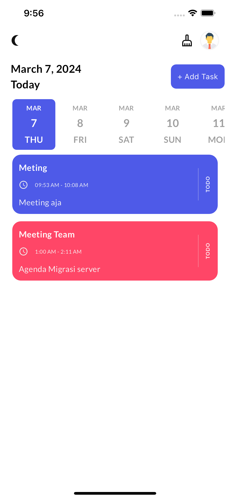
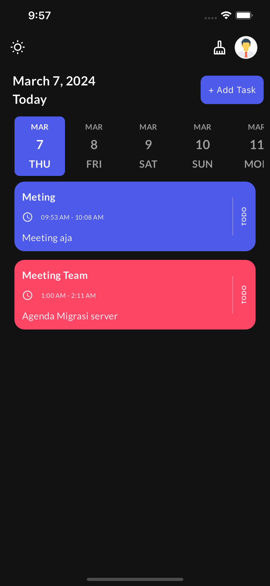
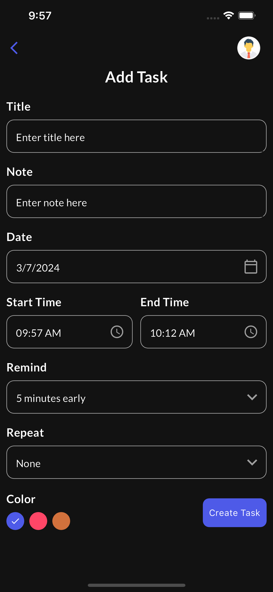

<h1 align="center">ToDo Apps</h1>

<h3 align="center">
   :dart: About : 
  With this application,You can learn about Add To Do app in the app.
</h3>

### Screenshots     
  

### Screenshots
 
## :rocket: Technologies

The following tools were used in this project:

- [Flutter](https://flutter.dev/)
- [Dart](https://dart.dev/)
- [Vs Code](https://code.visualstudio.com/)
- [Android Studio](https://developer.android.com/studio?gclid=Cj0KCQiAyJOBBhDCARIsAJG2h5eL8TqlTcYWCGcBIPw1fvDCI8-HFaYlvzdfH8GUd_-j9kX9SbFTTJkaAo3MEALw_wcB&gclsrc=aw.ds)

A few resources to get you started if this is your first Flutter project:

- [Lab: Write your first Flutter app](https://docs.flutter.dev/get-started/codelab)
- [Cookbook: Useful Flutter samples](https://docs.flutter.dev/cookbook)

For help getting started with Flutter development, view the
[online documentation](https://docs.flutter.dev/), which offers tutorials,
samples, guidance on mobile development, and a full API reference.
